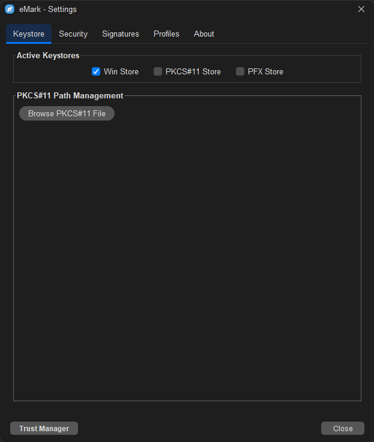
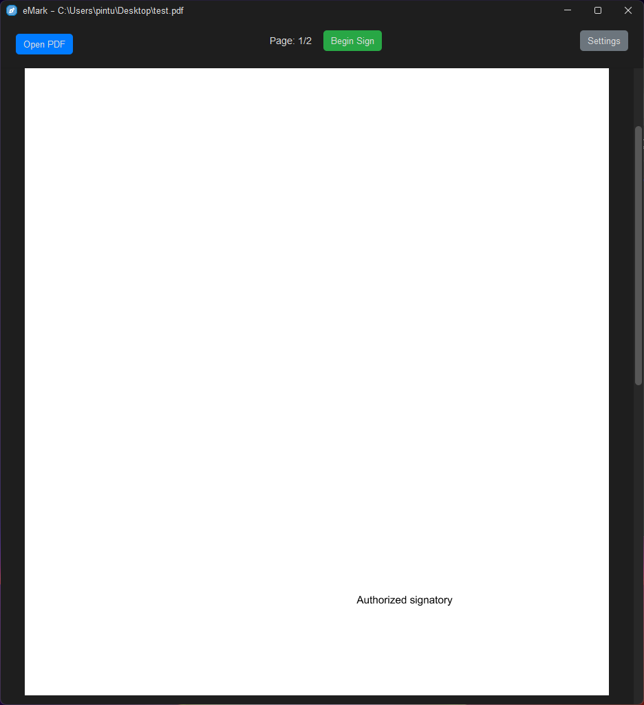
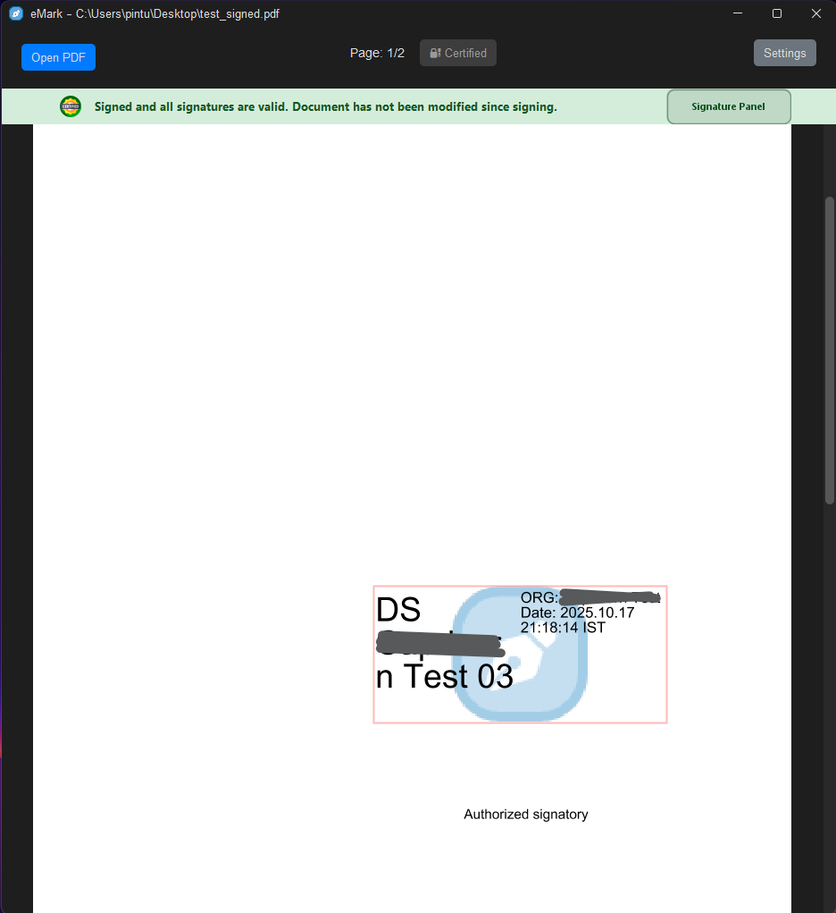

<div align="center">

<!-- HERO SECTION -->


<br>

# eMark PDF Signer

<h3>Enterprise-Grade PDF Digital Signature Solution</h3>

<p align="center">
<strong>Secure</strong> &nbsp;|&nbsp; <strong>Compliant</strong> &nbsp;|&nbsp; <strong>Open Source</strong>
</p>

<br>

[](https://github.com/trexolab-dev/emark-pdf-signer/releases/latest)
[](LICENSE)
[](https://openjdk.org/)
[](https://github.com/trexolab-dev/emark-pdf-signer/stargazers)

<br>

[**Explore Docs**](https://trexolab-dev.github.io/emark-pdf-signer/#/installation) &nbsp;&nbsp;|&nbsp;&nbsp; [**Download Now**](https://github.com/trexolab-dev/emark-pdf-signer/releases/latest) &nbsp;&nbsp;|&nbsp;&nbsp; [**View Demo**](https://trexolab-dev.github.io/emark-pdf-signer/) &nbsp;&nbsp;|&nbsp;&nbsp; [**Report Issue**](https://github.com/trexolab-dev/emark-pdf-signer/issues)

<br>

<!-- SCREENSHOT -->
<picture>
  
</picture>

<br>
<br>

<sub>Developed and maintained by <a href="https://trexolab.com"><strong>TrexoLab</strong></a></sub>

</div>

<br>

---

<br>

## About

**eMark PDF Signer** is a professional-grade, open-source application designed for creating legally binding digital signatures on PDF documents. Built with enterprise security standards in mind, it provides seamless integration with hardware security modules (HSM), software certificates, and native platform keystores.

Whether you're an individual professional, a small business, or a large enterprise, eMark PDF Signer delivers the reliability and compliance you need for document signing workflows.

<br>

### Why Choose eMark PDF Signer?

<table>
<tr>
<td align="center" width="25%">
<br>

<br><br>
<strong>Bank-Level Security</strong>
<br>
<sub>PKCS#11/PKCS#12 standards with hardware token support</sub>
<br><br>
</td>
<td align="center" width="25%">
<br>

<br><br>
<strong>Legal Compliance</strong>
<br>
<sub>Adobe-compatible signatures with RFC 3161 timestamps</sub>
<br><br>
</td>
<td align="center" width="25%">
<br>

<br><br>
<strong>Cross-Platform</strong>
<br>
<sub>Native support for Windows, Linux, and macOS</sub>
<br><br>
</td>
<td align="center" width="25%">
<br>

<br><br>
<strong>100% Open Source</strong>
<br>
<sub>Transparent, auditable, community-driven</sub>
<br><br>
</td>
</tr>
</table>

<br>

---

<br>

## Features

<details>
<summary><strong>Digital Signature Capabilities</strong></summary>

<br>

| Feature | Description |
|:--------|:------------|
| **X.509 Certificate Signing** | Create signatures using industry-standard X.509 digital certificates |
| **Visual Signatures** | Place signature boxes anywhere on the document with custom positioning |
| **Invisible Signatures** | Apply cryptographic signatures without visible marks |
| **Multiple Signatures** | Add multiple signatures to a single document |
| **Signature Validation** | Verify existing signatures and certificate chains |

</details>

<details>
<summary><strong>Certificate & Token Support</strong></summary>

<br>

| Type | Supported Devices/Formats |
|:-----|:--------------------------|
| **PKCS#11 Hardware Tokens** | SafeNet eToken, Gemalto, ProxKey, mToken, Watchdata, Feitian, and more |
| **PKCS#12/PFX Files** | Standard `.pfx` and `.p12` certificate files with private keys |
| **Windows Certificate Store** | Full integration with Windows personal certificate store |
| **Smart Cards** | Any PKCS#11 compliant smart card reader |

</details>

<details>
<summary><strong>Security & Compliance</strong></summary>

<br>

| Feature | Standard |
|:--------|:---------|
| **Timestamping** | RFC 3161 compliant trusted timestamps |
| **Hash Algorithms** | SHA-256, SHA-384, SHA-512 |
| **Certificate Validation** | Full chain verification with OCSP/CRL support |
| **Adobe Compatibility** | Signatures validate in Adobe Acrobat Reader |

</details>

<details>
<summary><strong>User Experience</strong></summary>

<br>

- Modern, intuitive user interface powered by FlatLaf
- Drag-and-drop signature placement
- Real-time PDF preview and navigation
- Customizable signature appearance (text, images, logos)
- Remember certificate preferences
- Dark and light theme support

</details>

<br>

---

<br>

## Installation

### System Requirements

| Component | Minimum | Recommended |
|:----------|:--------|:------------|
| **OS** | Windows 7+ / Ubuntu 18.04+ / macOS 10.14+ | Windows 10+ / Ubuntu 22.04+ / macOS 12+ |
| **RAM** | 512 MB | 2 GB |
| **Disk Space** | 150 MB | 250 MB |
| **Display** | 1024 x 768 | 1920 x 1080 |

<br>

### Download

> **All installers include bundled Java 8 runtime. No additional setup required.**

<div align="center">

<table>
<tr>
<th align="center">Platform</th>
<th align="center">Architecture</th>
<th align="center">Download</th>
</tr>
<tr>
<td align="center" rowspan="2">

<br><strong>Windows</strong>
</td>
<td align="center">64-bit (x64)</td>
<td align="center">
<a href="https://github.com/trexolab-dev/emark-pdf-signer/releases/latest/download/emark-pdf-signer-x64-setup.exe">

</a>
</td>
</tr>
<tr>
<td align="center">32-bit (x86)</td>
<td align="center">
<a href="https://github.com/trexolab-dev/emark-pdf-signer/releases/latest/download/emark-pdf-signer-x86-setup.exe">

</a>
</td>
</tr>
<tr>
<td align="center" rowspan="2">

<br><strong>Linux</strong>
</td>
<td align="center">64-bit (x64)</td>
<td align="center">
<a href="https://github.com/trexolab-dev/emark-pdf-signer/releases/latest/download/emark-pdf-signer-x64.deb">

</a>
&nbsp;
<a href="https://github.com/trexolab-dev/emark-pdf-signer/releases/latest/download/emark-pdf-signer-x64-linux.tar.gz">

</a>
</td>
</tr>
<tr>
<td align="center">32-bit (x86)</td>
<td align="center">
<a href="https://github.com/trexolab-dev/emark-pdf-signer/releases/latest/download/emark-pdf-signer-x86.deb">

</a>
&nbsp;
<a href="https://github.com/trexolab-dev/emark-pdf-signer/releases/latest/download/emark-pdf-signer-x86-linux.tar.gz">

</a>
</td>
</tr>
<tr>
<td align="center">

<br><strong>macOS</strong>
</td>
<td align="center">Intel (x64)*</td>
<td align="center">
<a href="https://github.com/trexolab-dev/emark-pdf-signer/releases/latest/download/emark-pdf-signer-x64-macos.dmg">

</a>
</td>
</tr>
</table>

<sub>*Apple Silicon (M1/M2/M3/M4) users: The x64 build runs via Rosetta 2 translation.</sub>

</div>

<br>

<details>
<summary><strong>Installation Instructions</strong></summary>

<br>

**Windows:**
```
1. Download the .exe installer
2. Run the installer as Administrator
3. Follow the installation wizard
4. Launch eMark PDF Signer from Start Menu or Desktop
```

**Linux (Debian/Ubuntu):**
```bash
# Download the .deb package, then:
sudo dpkg -i emark-pdf-signer-x64.deb
sudo apt-get install -f  # Install dependencies if needed
```

**Linux (Other distributions):**
```bash
# Download the .tar.gz package, then:
tar -xzf emark-pdf-signer-x64-linux.tar.gz
cd emark-pdf-signer
./emark-pdf-signer  # Run the application
```

**macOS (Intel & Apple Silicon via Rosetta 2):**
```
1. Download the .dmg file
2. Open the DMG and drag eMark PDF Signer to Applications
3. Right-click and select "Open" on first launch
```

</details>

<br>

---

<br>

## Quick Start Guide

<table>
<tr>
<td width="50%">

### 1. Configure Certificate

Navigate to **Settings > Keystore** to configure your signing certificate:

- **USB Token**: Select PKCS#11 and browse to your token's driver
- **PFX File**: Select PKCS#12 and browse to your certificate file
- **Windows Store**: Select Windows Certificate Store (Windows only)

</td>
<td width="50%">

</td>
</tr>
<tr>
<td width="50%">

</td>
<td width="50%">

### 2. Open PDF Document

- Click **File > Open** or drag-and-drop a PDF
- Navigate through pages using the toolbar
- Zoom in/out for precise signature placement

</td>
</tr>
<tr>
<td width="50%">

### 3. Place & Sign

- Click the **Sign** button in the toolbar
- Draw a rectangle where you want the signature
- Enter your certificate PIN/password when prompted
- Customize appearance if desired

</td>
<td width="50%">

</td>
</tr>
<tr>
<td width="50%">

</td>
<td width="50%">

### 4. Save & Verify

- Save the signed document
- The signature panel shows signature validity
- Open in Adobe Reader to verify compatibility

</td>
</tr>
</table>

<br>

---

<br>

## Architecture

<div align="center">

</div>

<br>

<details>
<summary><strong>Component Overview</strong></summary>

<br>

```
┌─────────────────────────────────────────────────────────────────────────┐
│                           PRESENTATION LAYER                            │
│  ┌─────────────────┐  ┌─────────────────┐  ┌─────────────────────────┐  │
│  │   Main Window   │  │  Settings UI    │  │   Signature Dialogs     │  │
│  │   (Swing/FlatLaf)│  │                 │  │                         │  │
│  └────────┬────────┘  └────────┬────────┘  └────────────┬────────────┘  │
└───────────┼─────────────────────┼───────────────────────┼───────────────┘
            │                     │                       │
┌───────────┼─────────────────────┼───────────────────────┼───────────────┐
│           ▼                     ▼                       ▼               │
│                           BUSINESS LAYER                                │
│  ┌─────────────────┐  ┌─────────────────┐  ┌─────────────────────────┐  │
│  │  PDF Renderer   │  │ Certificate     │  │   Signature Engine      │  │
│  │  (PDFBox)       │  │ Manager         │  │   (iText + BC)          │  │
│  └─────────────────┘  └─────────────────┘  └─────────────────────────┘  │
└─────────────────────────────────────────────────────────────────────────┘
            │                     │                       │
┌───────────┼─────────────────────┼───────────────────────┼───────────────┐
│           ▼                     ▼                       ▼               │
│                         INTEGRATION LAYER                               │
│  ┌─────────────────┐  ┌─────────────────┐  ┌─────────────────────────┐  │
│  │   File System   │  │  PKCS#11/12     │  │   Timestamp Server      │  │
│  │                 │  │  Providers      │  │   (RFC 3161)            │  │
│  └─────────────────┘  └─────────────────┘  └─────────────────────────┘  │
└─────────────────────────────────────────────────────────────────────────┘
```

</details>

<br>

---

<br>

## Development

### Prerequisites

```
Java JDK 8 (1.8.x)     ─────  Required (higher versions not supported)
Apache Maven 3.x       ─────  Build automation
Git                    ─────  Version control
```

<br>

### Build from Source

```bash
# Clone the repository
git clone https://github.com/trexolab-dev/emark-pdf-signer.git
cd emark-pdf-signer

# Build the project
mvn clean package

# Run the application
java -jar target/eMark-PDF-Signer.jar
```

<br>

### Project Structure

```
emark-pdf-signer/
│
├── src/
│   └── main/
│       ├── java/                    # Application source code
│       │   └── com/trexolab/emark/
│       │       ├── core/            # Core signing logic
│       │       ├── ui/              # User interface components
│       │       ├── crypto/          # Cryptographic operations
│       │       └── utils/           # Utility classes
│       │
│       └── resources/
│           ├── icons/               # Application icons
│           └── config/              # Default configurations
│
├── distributions/                   # Platform installers
│   ├── windows/                     # Windows-specific files
│   ├── linux/                       # Linux-specific files
│   └── macos/                       # macOS-specific files
│
├── website/                         # Documentation website (React)
├── docs/                            # GitHub Pages deployment
│
├── pom.xml                          # Maven build configuration
├── VERSION                          # Version number
├── LICENSE                          # AGPL-3.0 license
└── README.md                        # This file
```

<br>

### Technology Stack

<table>
<tr>
<td>

**Core Technologies**

| Component | Technology |
|:----------|:-----------|
| Language | Java 8 |
| UI Framework | Swing |
| Look & Feel | FlatLaf 3.x |
| Build Tool | Apache Maven |

</td>
<td>

**Key Libraries**

| Library | Purpose |
|:--------|:--------|
| iText 5.5.x | PDF signing operations |
| Apache PDFBox 2.x | PDF rendering & parsing |
| Bouncy Castle | Cryptographic provider |
| SunPKCS11 | Hardware token interface |

</td>
</tr>
</table>

<br>

---

<br>

## Contributing

We welcome contributions from developers of all skill levels. Here's how you can help make eMark PDF Signer better:

<br>

### Getting Started

1. **Fork** the repository
2. **Clone** your fork locally
3. **Create** a feature branch
   ```bash
   git checkout -b feature/your-feature-name
   ```
4. **Make** your changes
5. **Test** thoroughly
6. **Commit** with clear messages
   ```bash
   git commit -m "Add: description of your feature"
   ```
7. **Push** to your fork
   ```bash
   git push origin feature/your-feature-name
   ```
8. **Submit** a Pull Request

<br>

### Contribution Ideas

| Area | Description |
|:-----|:------------|
| **Bug Fixes** | Fix reported issues from the issue tracker |
| **Features** | Implement requested features or propose new ones |
| **Documentation** | Improve README, code comments, or wiki |
| **Testing** | Add unit tests or integration tests |
| **Translations** | Help translate the UI to other languages |
| **Security** | Report vulnerabilities responsibly |

<br>

Please read our [**Contributing Guidelines**](CONTRIBUTING.md) before submitting a PR.

<br>

---

<br>

## Roadmap

- [ ] Batch signing for multiple documents
- [ ] Command-line interface (CLI) mode
- [ ] PDF/A compliance support
- [ ] LTV (Long-Term Validation) signatures
- [ ] Cloud certificate integration
- [ ] Plugin architecture

<br>

---

<br>

## Support

<table>
<tr>
<td align="center" width="33%">

**Documentation**

Comprehensive guides and tutorials

[**Read the Docs**](https://trexolab-dev.github.io/emark-pdf-signer/)

</td>
<td align="center" width="33%">

**Issues**

Bug reports and feature requests

[**GitHub Issues**](https://github.com/trexolab-dev/emark-pdf-signer/issues)

</td>
<td align="center" width="33%">

**Community**

Connect with other users

[**Discussions**](https://github.com/trexolab-dev/emark-pdf-signer/discussions)

</td>
</tr>
</table>

<br>

---

<br>

## License

<table>
<tr>
<td>

</td>
<td>

This project is licensed under the **GNU Affero General Public License v3.0**.

You are free to use, modify, and distribute this software. If you modify and deploy it as a network service, you must release your source code under the same license.

[**Read Full License**](LICENSE)

</td>
</tr>
</table>

<br>

---

<br>

<div align="center">

### Acknowledgments

Special thanks to all [**contributors**](https://github.com/trexolab-dev/emark-pdf-signer/graphs/contributors) who have helped make eMark PDF Signer better.

<br>

---

<br>


<br>

**eMark PDF Signer** — Professional PDF Digital Signatures Made Simple

<br>

[Website](https://trexolab-dev.github.io/emark-pdf-signer/) &nbsp;&nbsp;•&nbsp;&nbsp; [Releases](https://github.com/trexolab-dev/emark-pdf-signer/releases) &nbsp;&nbsp;•&nbsp;&nbsp; [Documentation](https://trexolab-dev.github.io/emark-pdf-signer/#/installation) &nbsp;&nbsp;•&nbsp;&nbsp; [TrexoLab](https://trexolab.com)

<br>

**If eMark PDF Signer helps you, consider giving it a star!**

[](https://github.com/trexolab-dev/emark-pdf-signer)

<br>

---

<sub>Copyright © 2024 TrexoLab. All rights reserved.</sub>

</div>
